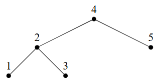
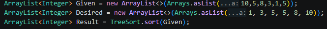
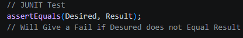
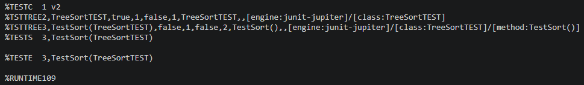
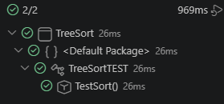

# Treesort Project | Two Mains

## Quick Overview:

This Project's task was to create a TreeSorting Algorithm, which would be able to sort An Array/List into Numerical Order.

For instance:

Unsorted List = [10,5,8,3,1,5] \
Sorted List = [1,3,5,5,8,10]

In Essence, the TreeSort algorithm will sort Elements into Ascending Order.
It does this through creating a binary tree, and establishing a Root Node (First element of the list). Each following number then travels down the tree, at every node it passes, if the value is less than the current node, it goes left, if it is equal to or greater than the current, then it goes right. This continues until the number finds an empty spot and is inserted there.

Once all numbers have been inserted, the tree is walked in-order, left subtree first, then the current node, then the right subtree. Leaving us with, once it walks through the list (going through the tree), starting with the Left Side, and them going to the Right, we get our list back in ascending order.

## A Diagram (Provided By Dr Thomas Bending)

Using what a TreeSort does, it'll start from 1, then go to 2, then will read 3, then up to 4, then right to 5.\
Therefore, sorting this into [1,2,3,4,5].

## How To Use:

Once you download this entire repository as a .zip file (Or download the source code zip from the release page), and, using something like VSCode, Run Either MainUSERINPUT or just Main.

Running MainUSERINPUT will provide you with a way to manually input each and every element yourselves.

Running Main requires you to edit the "Arrays.asList(4,2,3,5,1)" section, where the values within the asList() part is what must be changed.

I provided both on purpose, if you have a list that you would like to copy and paste, use the regular "Main" script, if you want to manually input each value on the fly (as if you where just inputting random elements, only suitable for shorter arrays if you value your time), you will use "MainUSERINPUT" instead.

## Programme Testing Proof:
The part that show's that the code does work.
I used JUNIT for this.

### //// JUnit Test Results ////
%TESTC  1 v2
%TSTTREE2,TreeSortTEST,true,1,false,1,TreeSortTEST,,[engine:junit-jupiter]/[class:TreeSortTEST]
%TSTTREE3,TestSort(TreeSortTEST),false,1,false,2,TestSort(),,[engine:junit-jupiter]/[class:TreeSortTEST]/[method:TestSort()]
%TESTS  3,TestSort(TreeSortTEST)

%TESTE  3,TestSort(TreeSortTEST)

%RUNTIME109

 \
(This is just another way of showing that the test succeeded)

### //// END OF TEST ////

THERE IS NO %FAILED Present, the Sorted Given Array is the same as our Desired Array (Our unsorted, when sorted, is the same as our sorted known array) \
This result throws no errors, this test therefore, tells us that this should work correctly when sorting Arrays into Ascending Order.

### J-UNIT Doc Sources:
https://junit.org/junit5/docs/current/user-guide/
https://junit.org/junit5/docs/current/api/org.junit.jupiter.api/org/junit/jupiter/api/Assertions.html
https://mvnrepository.com/artifact/org.junit.platform/junit-platform-console-standalone/1.10.0

## GIT Log:

For the gitlog file, you can find them in the /docs, however, the relevant log is shown below as well for clarity. \
(git log --all --oneline --graph > gitlog.txt) <--- Used To Generate Logs.

If you cant access this, go to "docs/gitlog.txt" of this repository.\
Both Methods done just in case any internet problems occur.
